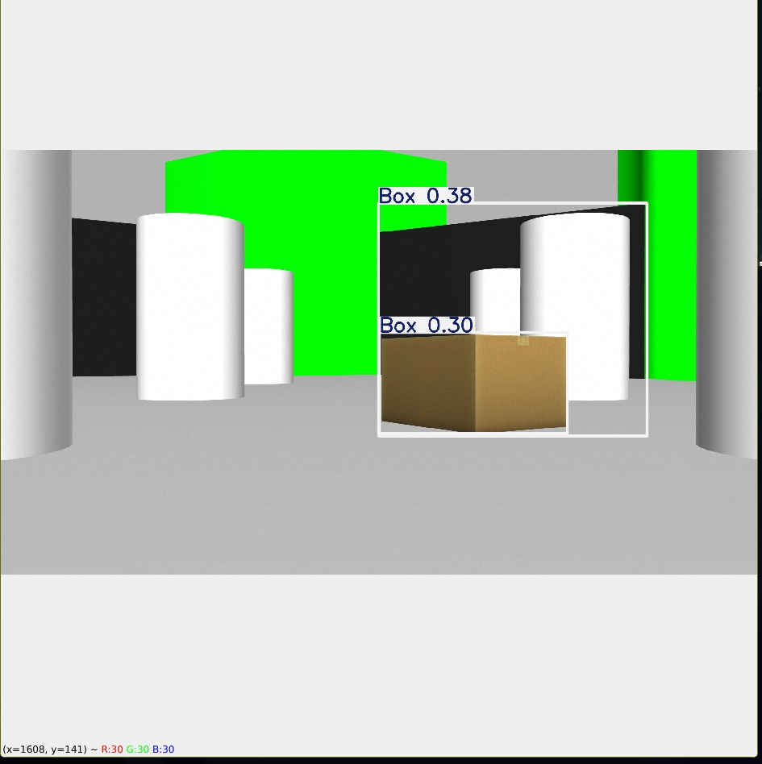
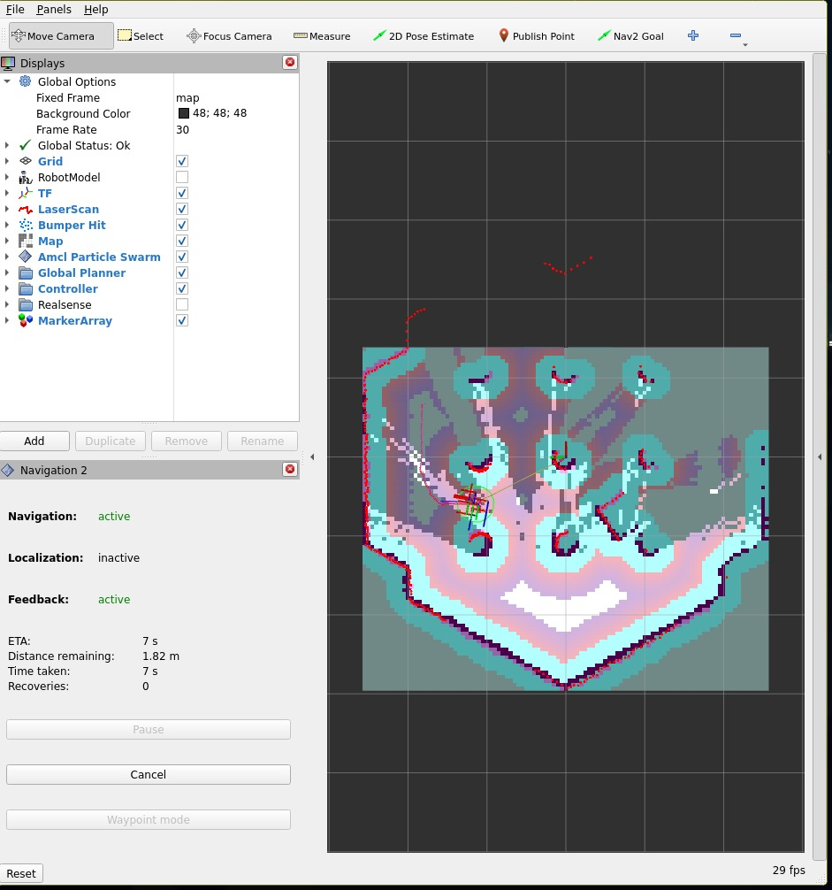
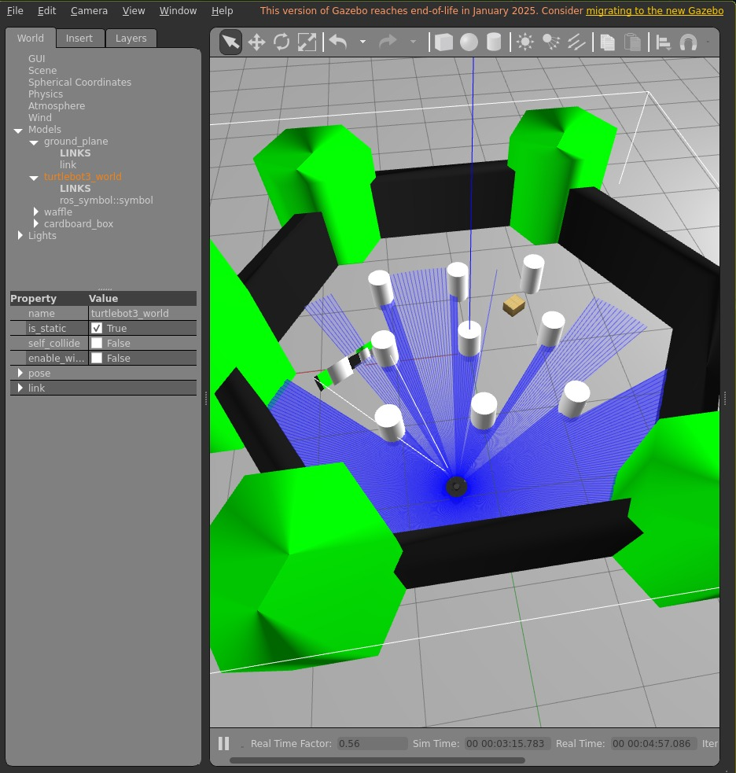

#  SLAM-Based Object Navigation System

A modular ROS 2--based autonomous robotic system capable of 2D
SLAM mapping, real-time object detection, and intelligent navigation to
detected targets. The system runs entirely in a Gazebo simulation using
the TurtleBot3 world environment.

Designed with scalability in mind, the architecture allows seamless
integration of future modules such as delivery or manipulation systems.

------------------------------------------------------------------------

##  Core Features

-   2D SLAM-based autonomous exploration
-   Real-time object detection using YOLO
-   Intelligent navigation to detected objects
-   Modular and extensible system architecture
-   Fully simulated in Gazebo (TurtleBot3 World)

------------------------------------------------------------------------

## Tech Stack

-   ROS 2 Humble
-   Nav2
-   SLAM Toolbox
-   YOLO (General Object Detection Model)
-   Gazebo Simulation
-   TurtleBot3

------------------------------------------------------------------------

##  Object Detection

The system uses a general-purpose YOLO model for object detection.
The detection module is modular and can be easily replaced with:

-   Higher-level YOLO variants
-   Custom-trained models
-   Alternative deep learning detection frameworks

This makes the system adaptable to different application requirements.

------------------------------------------------------------------------

##  SLAM Mapping & Exploration

The robot autonomously explores a 2D environment and generates a
real-time occupancy grid map using SLAM. The generated map is then used
for intelligent path planning and navigation.

------------------------------------------------------------------------

## System Demonstration

###  YOLO Object Detection



###  Map Generation (SLAM)



### Gazebo Simulation (TurtleBot3 World)



------------------------------------------------------------------------

##  How to Run

1. clone the repo to your ROS workspace src folder
``` bash
colcon build
source install/setup.bash
```
2. To run the simulation 
``` bash
ros2 launch slam_based_nav gazebo.launch.py
```
3. Run any explorer to make the bot to explore the area
``` bash
ros2 run slam_bassed_nav explorer<' '/2/3>.py
```
4. Run Object Mapper to make the bot to detect object based on Yolo model(General model used here can youe a different one)
``` bash
ros2 run slam_bassed_nav object_mapper_lider.py
``` 
5. To make the bot to go to the ditected object stop the explorer and run Object_reacher
``` bash
ros2 run slam_bassed_nav object_reacher.py
```

------------------------------------------------------------------------

##  Modular Architecture

The system is designed to support future expansion modules such as:

-   Autonomous delivery attachment
-   Robotic manipulation arm
-   Smart payload transport system
-   Advanced perception modules

------------------------------------------------------------------------

##  Future Enhancements

-   Integration of delivery module
-   Dynamic object tracking
-   Multi-robot coordination
-   Real-world hardware deployment

------------------------------------------------------------------------

Developed as an advanced autonomous robotics project integrating SLAM,
computer vision, and intelligent navigation in a modular ROS 2
framework.
